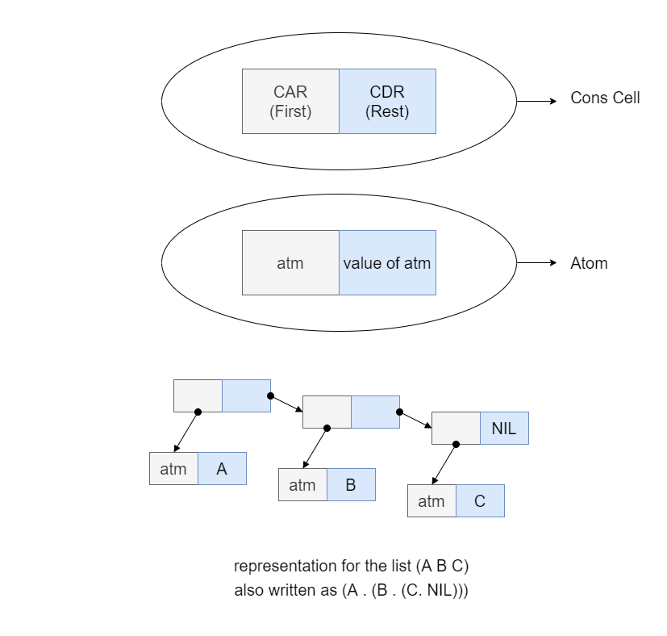

# Pure Lisp Sample Codes

This repo contains the source codes in `Part 1-3 (Lisp: Functions, Recursion, and Lists)` of `Concepts in Programming Languages` By `John C. Mitchell`.

# Install Clisp

- On Ubuntu/Debian: `sudo apt install clisp`
- On Mac: `brew install clisp`
- On Windows: [Download](https://sourceforge.net/projects/clisp/)

# Source Codes

You can see this source codes in the [codes directory](./codes).

# Internal Representation
> Lisp lists are represented internally using a tree-like structure of nodes. Each node has two pointers, a left pointer and a right pointer. The left pointer points to a list element (which can be either an atom or another list) and the right pointer points to the remainder of the list.



# Cheat Sheet
First of all what is form in lisp?
> A Lisp object that is intended to be evaluated is called a form (or an expression).

you can execute functions in lisp using this syntax:
```lisp
(function_name_or_operator arg1 arg2 ...)
```

Function/Operator | Description | Example | Output | Output Type
-|-|-|-|-
**cons**|create a new [Cons Cell](https://en.wikipedia.org/wiki/Cons)| - | - | -
➜|(cons atom list)|(cons 1 '(2))| (1 2) | List
➜|(cons list atom)|(cons '(2) 5)| ((2) . 5) | Cons Cell
➜|(cons atom atom)|(cons 1 2)| (1 . 2) | Cons Cell
➜|(cons list list)|(cons '(1 2) '(3))| ((1 2) 3) | List
car|returns first element of the list| (car '(1 2)) | 1 | Atom
cdr|returns everything after first element of list as a list| (cdr '(1 2)) | (2) | List
eq|returns T if equal else NIL|(eq 2 2)|T| Atom
equal/eql/equalp|[Read here](https://stackoverflow.com/questions/547436/whats-the-difference-between-eq-eql-equal-and-equalp-in-common-lisp)|-|-|-
cond|condition|(cond (cond1 (exp)) (cond2 (exp)) ... (T (last)))| - | -
lambda|[Read here](https://stackoverflow.com/questions/13213611/writing-lambda-expressions-in-common-lisp)|-|-|-
funcall/apply|[Read here](https://stackoverflow.com/questions/3862394/when-do-you-use-apply-and-when-funcall)|-|-|-
quote|Create a list|(quote(1 2 3)) or '(1 2 3)|(1 2 3)| List
eval|expects a form to be evaluated and executed as argument.|(eval '(+ 1 2))|3| depends on form
defun|define function|-|-|-
"+ - * / mod"|mathematic operators|(+ 1 2)|3| Atom
"< > = <= >="|boolean operators|(< 2 5)|T| Atom
rplaca|replaces the car of the cons with object|(rplaca '(1 2) 5)|(5 2)|-
**rplacd**|replaces the cdr of the cons with object|-|-|-
➜|(rplacd list atom)|(rplacd '(1 2) 5)|(1 . 5)|Cons Cell
➜|(rplacd list list)|(rplacd '(1 2) '(4 5))|(1 4 5)|List
